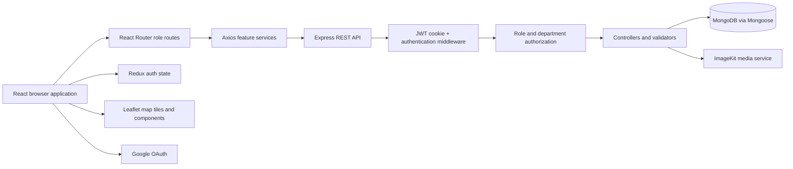
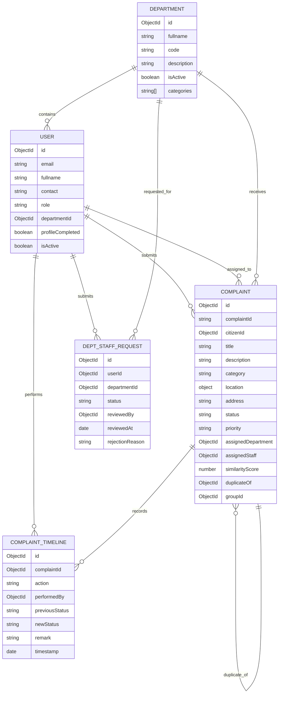
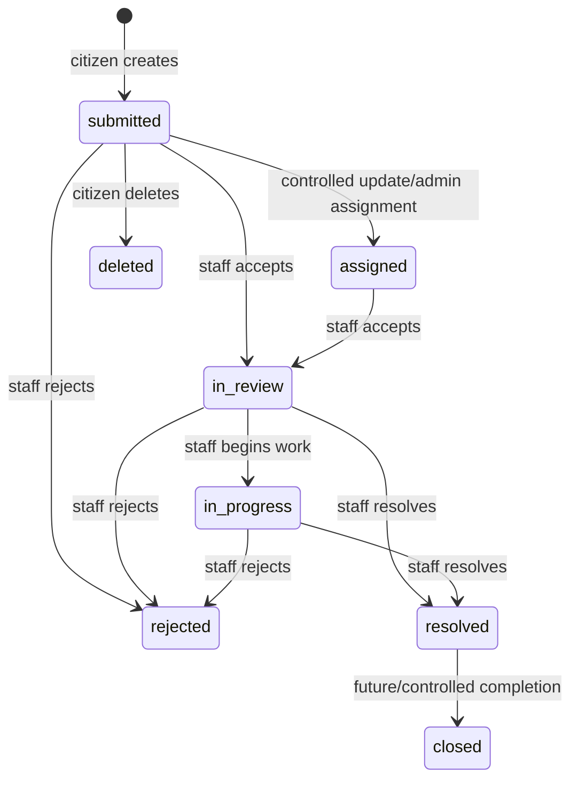
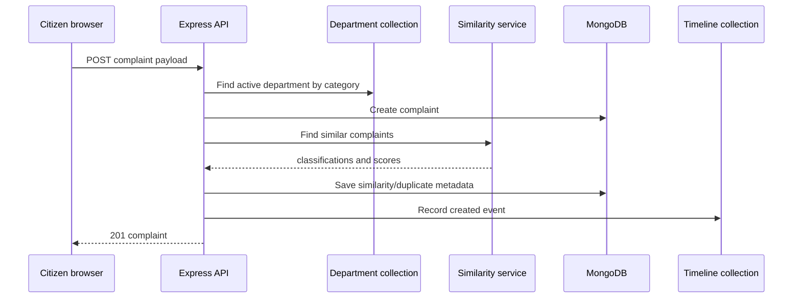
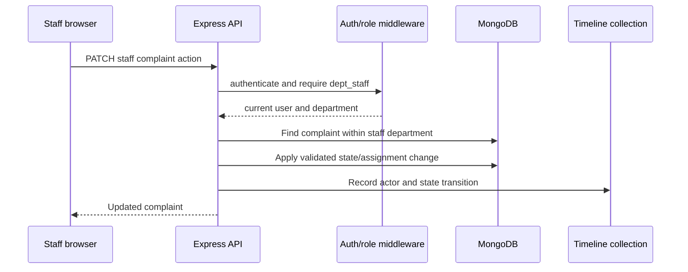

# CivicFlow Technical Architecture

**Prepared:** 15 September 2026  
**Implementation basis:** current source tree at the approximately 70% milestone

## 1. System purpose

CivicFlow is a full-stack civic complaint management application. It connects three actors:

- **Citizen:** submits and tracks a civic complaint.
- **Department staff:** processes complaints routed to the staff member's department.
- **Administrator:** manages departments and approves or rejects requests for department-staff access.

The core architectural objective is to preserve a complaint's context through its lifecycle:

```text
citizen evidence -> validated API request -> department routing -> staff queue
-> controlled action -> resolution evidence -> persisted timeline
```

The system is a functional prototype. It has a coherent end-to-end architecture, but production deployment would require additional security, testing, observability, scaling, privacy, accessibility, and interoperability work.

## 2. High-level architecture



### Deployment units

1. **Frontend development/build unit**
   - Vite-powered React application.
   - Runs on the frontend development server.
   - Uses the Vite `/api` proxy during local development, although several Axios services currently use an explicit backend base URL.

2. **Backend API unit**
   - Node.js process started by `BACKEND/server.js`.
   - Express application mounted from `BACKEND/src/app.js`.
   - Connects to MongoDB before listening.

3. **MongoDB data unit**
   - Stores users, departments, complaints, staff requests, and timeline events.
   - Mongoose schemas provide validation, references, timestamps, and indexes.

4. **External services**
   - Google OAuth supplies identity information for SSO onboarding.
   - ImageKit stores uploaded complaint media and returns references.
   - Leaflet renders maps and location-related UI in the browser.

## 3. Backend bootstrap and infrastructure

### 3.1 Process startup

`BACKEND/server.js` loads environment variables, imports the Express app and database connector, connects to MongoDB, and starts listening on `PORT`. If database startup fails, the process logs the error and exits.

This startup order prevents the server from presenting a healthy listening state before its primary data dependency is available.

### 3.2 Configuration

`BACKEND/src/config/config.js` validates required environment variables:

- `MONGO_URI`
- `JWT_SECRET`
- `GOOGLE_CLIENT_ID`
- `GOOGLE_CLIENT_SECRET`
- `NODE_ENV`
- `IMAGE_KIT_PRIVATE_KEY`

The module exports a central configuration object. This is useful because missing deployment secrets fail early instead of causing an obscure request-time failure.

### 3.3 Database initialization

`BACKEND/src/config/database.js` connects with Mongoose and invokes the department seed operation. `seed.js` upserts five initial departments:

- Public Works
- Sanitation
- Water Supply
- Electrical
- Drainage

Each seeded department maps supported complaint categories to an operational destination. The intended benefit is deterministic startup data for a demonstrable prototype.

### 3.4 Express middleware stack

`BACKEND/src/app.js` configures:

1. Morgan request logging.
2. JSON body parsing.
3. URL-encoded body parsing.
4. Cookie parsing.
5. CORS with frontend origin and credentials.
6. Passport initialization.
7. Google OAuth strategy.
8. Route mounting for auth, requests, departments, complaints, and timelines.

The route modules are mounted under `/api`, with authentication routes mounted under `/api/auth`.

## 4. Authentication architecture

### 4.1 Local account flow

1. The frontend registration form calls `POST /api/auth/register`.
2. `validateRegister` checks email, contact, password length, and full name.
3. The controller checks for an existing email or contact.
4. A `User` document is created with the default citizen role.
5. The Mongoose pre-save hook hashes `passwordHash` using bcrypt.
6. A JWT containing the user ID is signed.
7. The backend sets the JWT in an HTTP-only cookie and returns sanitized user information.

Login follows the same session response pattern after password comparison.

### 4.2 Google OAuth flow

1. The frontend requests the Google login URL.
2. Passport redirects the user to Google.
3. Google returns a profile to the callback route.
4. The backend locates or creates a Google-linked user.
5. New users are marked `profileCompleted: false` and sent to the completion form.
6. The user chooses citizen or department-staff intent.
7. Citizen completion activates a citizen profile.
8. Staff intent creates a pending staff request rather than immediately granting staff privileges.

The staff request is later approved by an administrator.

### 4.3 Session rehydration

`FRONTEND/src/app/App.jsx` invokes `handleGetCurrentUser()` on startup. The hook calls `GET /api/auth/me`. If the cookie is valid, the returned user is stored in the Redux auth slice. The `initialized` flag prevents route decisions before the session check completes.

### 4.4 Authentication middleware

`BACKEND/src/middleware/auth.middleware.js`:

1. Reads the token from the HTTP-only cookie or a Bearer Authorization header.
2. Verifies the token signature and expiration.
3. Loads the current user by the token's ID.
4. Rejects missing, invalid, unknown, or inactive accounts.
5. Attaches the full user document to `req.user`.

Only the user ID is trusted from the token; role and active state are re-read from the database. This helps role changes and account deactivation take effect without waiting for a token claim update.

### 4.5 Role authorization

`role.middleware.js` exports `requireRole(...allowedRoles)` and the `requireDeptStaff` specialization. The backend uses these guards on sensitive endpoints. The frontend has corresponding `ProtectedRoute` and `RoleRoute` components for navigation control, but frontend guards are not treated as the security boundary.

## 5. Data architecture



### 5.1 User model

`user.model.js` stores identity, authentication provider, role, optional department, profile completion state, image reference, and active state. Roles are enumerated as `citizen`, `dept_staff`, and `admin`.

The `departmentId` reference is null for ordinary citizens and administrators unless a future policy says otherwise. Approved staff users receive the selected department ID.

### 5.2 Department model

A department has a display name, unique code, optional description, active flag, and category list. Category membership is the current routing mechanism.

### 5.3 Complaint model

A complaint contains:

- Internal MongoDB identity and generated human-facing `CF-...` complaint ID.
- Citizen ownership reference.
- Title, description, category, address, and status.
- GeoJSON point location.
- Citizen media references.
- Priority.
- Department and staff assignment references.
- Assignment timestamp.
- Similarity score, duplicate relationship, and group relationship.
- Resolution description and resolution media.
- Created and updated timestamps.

The schema has a `2dsphere` index on location, supporting future proximity queries and geospatial operations.

### 5.4 Media representation

Media is not embedded as raw binary data in the complaint document. The upload route receives multipart files in memory, validates each file, sends it to ImageKit, and stores returned references in the complaint's media array. A media entry includes `fileId`, `url`, `type`, and optional metadata.

### 5.5 Timeline model

Timeline entries are separate records with a complaint reference, action, actor, previous status, new status, optional remark, and timestamp. The compound index on complaint ID and timestamp supports chronological retrieval.

### 5.6 Staff request model

A staff request stores applicant identity snapshot fields, department target, status, optional linked user ID, reviewing admin, review time, and rejection reason. For an already-authenticated citizen, `userId` links the request to the existing account. The request model also supports the older/unlinked shape through its conditional password requirement, although the current authenticated request path does not need a new password.

## 6. REST API architecture

### Authentication routes

| Method | Path | Access | Purpose |
|---|---|---|---|
| POST | `/api/auth/register` | Public | Create a citizen account |
| POST | `/api/auth/login` | Public | Authenticate local credentials |
| GET | `/api/auth/google` | Public | Begin Google OAuth |
| GET | `/api/auth/google/callback` | OAuth callback | Complete Google authentication |
| POST | `/api/auth/complete-profile` | Authenticated onboarding | Complete Google profile / create staff request |
| GET | `/api/auth/me` | Authenticated | Return current user |
| PUT | `/api/auth/me` | Authenticated | Update name, contact, image reference |
| POST | `/api/auth/logout` | Public/session | Clear login cookie |

### Department routes

| Method | Path | Access | Purpose |
|---|---|---|---|
| GET | `/api/departments` | Public | List active departments |
| GET | `/api/departments/:id` | Public | Read a department |
| POST | `/api/departments` | Admin | Create a department |
| PATCH | `/api/departments/:id` | Admin | Update department fields |
| DELETE | `/api/departments/:id` | Admin | Delete a department |

### Staff request routes

| Method | Path | Access | Purpose |
|---|---|---|---|
| POST | `/api/requests/staff` | Authenticated non-admin | Submit staff-access request |
| GET | `/api/requests/staff/me` | Authenticated | Read the user's request status |
| GET | `/api/admin/requests/staff` | Admin | List requests by status/department |
| GET | `/api/admin/requests/staff/:id` | Admin | Read a request |
| PATCH | `/api/admin/requests/staff/:id/approve` | Admin | Approve and promote applicant |
| PATCH | `/api/admin/requests/staff/:id/reject` | Admin | Reject with a reason |

### Citizen complaint routes

| Method | Path | Access | Purpose |
|---|---|---|---|
| POST | `/api/complaints/media` | Citizen | Validate/upload evidence |
| POST | `/api/complaints` | Citizen | Create complaint |
| GET | `/api/complaints/my` | Citizen | List own complaints |
| GET | `/api/complaints/:id` | Citizen owner | Read own complaint |
| PATCH | `/api/complaints/:id` | Citizen owner | Edit submitted complaint |
| DELETE | `/api/complaints/:id` | Citizen owner | Soft-delete complaint |

### Staff complaint routes

| Method | Path | Access | Purpose |
|---|---|---|---|
| GET | `/api/staff/complaints` | Department staff | List department queue |
| GET | `/api/staff/complaints/assigned` | Department staff | List complaints assigned to current staff |
| GET | `/api/staff/complaints/:id` | Admin/staff | Read operational complaint details |
| PATCH | `/api/staff/complaints/:id/accept` | Department staff | Accept/claim complaint |
| PATCH | `/api/staff/complaints/:id/reject` | Department staff | Reject with controlled reason |
| PATCH | `/api/staff/complaints/:id/status` | Department staff | Apply validated status transition |
| PATCH | `/api/staff/complaints/:id/resolve` | Department staff | Resolve with description/evidence |
| PATCH | `/api/staff/complaints/:id/assign` | Admin | Assign department/staff |

### Timeline route

`GET /api/complaints/:id/timeline` is available to citizens and department staff, with the controller filtering the complaint by citizen ownership or assigned department before returning timeline entries.

## 7. Complaint lifecycle



The exact accepted transitions are constrained by backend validation/controller logic. The important architectural principle is that the backend decides the previous state and records the transition, rather than trusting a client-supplied history.

### Creation sequence



### Staff action sequence



## 8. Frontend architecture

### 8.1 Application shell

`main.jsx` creates the React root, wraps the app with the Redux `Provider`, and loads Leaflet CSS. `App.jsx` performs initial session rehydration and renders the router.

`RootLayout` provides the shared navigation and outlet structure. `Navbar` changes its menu according to the current role.

### 8.2 Routing

`app.routes.jsx` uses React Router's browser router. Important route groups are:

- Public: `/register`, `/login`.
- Authenticated shared: `/request-dept-staff`, `/profile`.
- Citizen role: `/citizen/...`.
- Department staff role: `/staff/...`.
- Admin role: `/admin/...`.

`ProtectedRoute` checks authentication and profile completion. `RoleRoute` additionally checks allowed roles. The new shared `/profile` route reuses the profile editor for citizens, staff, and admins; role-specific menus link to it.

### 8.3 State boundaries

Global state is intentionally small:

```text
Redux auth state:
  user
  loading
  error
  initialized
```

Page and feature state remains local where possible:

- Complaint form fields and media selection in citizen hooks/components.
- Staff queue filters and modal state in staff pages/hooks.
- Admin request tabs, department forms, and review modal state in admin pages.
- Profile form edit state in the profile page.

This prevents every transient input from becoming global application state.

### 8.4 Feature modules

#### Authentication feature

Contains registration, login, Google onboarding, staff-access request page, API services, `useAuth`, and auth slice. It is responsible for session state and identity transitions.

#### Citizen feature

Contains the citizen dashboard, complaint report form, complaint list/detail/tracking pages, profile page, complaint service, complaint form hook, map selection, media upload, and citizen-facing timeline.

#### Staff feature

Contains staff dashboard, department queue, assigned queue, operational details, action panels/modals, staff hooks, and staff API services.

#### Admin feature

Contains admin dashboard, department governance controls, staff-request review page/components, and admin API services.

#### Shared components

Map components render location selection and complaint maps. Media components handle upload preview. Complaint components provide reusable cards, status display, timelines, and grouped-report summaries. Auth and layout components provide guards and navigation.

## 9. Validation and error handling

Validation occurs at multiple levels:

1. **Browser forms** provide required fields, input types, disabled states, and immediate messages.
2. **Express-validator** validates request shape and domain restrictions.
3. **Controller logic** checks ownership, active departments, duplicate pending requests, status transition rules, and resource existence.
4. **Mongoose schemas** enforce enum, required, reference, and range constraints.
5. **Frontend services/pages** convert API errors into loading, error, empty, or success states.

Protected complaint fields include citizen ID, status, assignment, similarity metadata, group/duplicate relationships, and resolution data. Citizen validators reject attempts to submit those fields directly.

## 10. Authorization examples

### Citizen complaint ownership

Citizen complaint reads and mutations include the authenticated citizen ID in their query. A citizen cannot use a known complaint ID to read another citizen's complaint through the citizen endpoints.

### Department staff scope

Staff queue queries constrain results to `assignedDepartment: req.user.departmentId`. Staff complaint actions also locate the complaint within that department. Assigned-complaint queries additionally constrain `assignedStaff` to the current user.

### Administrator boundary

Department mutation and staff-request review routes use `requireRole('admin')`. A normal citizen or staff member cannot call those endpoints successfully even if they manually construct the request.

## 11. External integration boundaries

### Google OAuth

Google is responsible for identity authentication. CivicFlow remains responsible for local user creation, profile completion, role selection, and staff-request governance. Google does not directly grant department-staff permissions.

### ImageKit

ImageKit is responsible for media storage/delivery. CivicFlow is responsible for file validation, association of returned references with a complaint, and authorization of who can upload media.

### Leaflet and map tiles

Leaflet is a browser rendering library. It does not decide complaint authorization or routing. The selected point is normalized to the backend's GeoJSON contract.

## 12. Current technical strengths

- Clear separation of route, middleware, controller, model, validator, and service responsibilities.
- Backend authorization exists independently of frontend visibility.
- Current user is reloaded from the database after JWT verification.
- Complaint ownership and department isolation are explicit query conditions.
- Timeline history is persisted instead of simulated only in the UI.
- Media is represented by external references rather than database binary blobs.
- Department approval promotion is wrapped in a database transaction.
- GeoJSON location is validated and indexed for future spatial queries.
- Feature-based frontend organization makes citizen, staff, admin, and auth work easier to locate.

## 13. Current architectural gaps and risks

1. **Notifications**
   No notification persistence or delivery service is currently present. Users must inspect dashboards/status pages.

2. **Automated testing**
   The backend package's test command is a placeholder. Integration tests should cover every role boundary, status transition, media failure, and ownership query.

3. **API documentation**
   The code contains route comments and testing notes, but there is no generated OpenAPI contract.

4. **Pagination and scale**
   Several list endpoints can return unbounded arrays. Add pagination, indexes, query limits, and performance tests.

5. **Cookie security**
   Production should use HTTPS, a deliberate SameSite/CSRF strategy, secure secret handling, token rotation/revocation, and security headers.

6. **Input and upload resilience**
   Memory-based uploads can pressure the API process. A production design should consider direct/resumable uploads, background processing, virus scanning, and explicit quotas.

7. **Concurrency and workflow policy**
   Assignment and status transitions need more exhaustive conflict tests. Transactions or conditional updates should be used where concurrent staff actions can race.

8. **Interoperability**
   The API is custom. An Open311 adapter would improve integration with external civic systems.

9. **Observability**
   Add structured logs, metrics, tracing, health/readiness endpoints, and error monitoring.

10. **Privacy and accessibility**
   Define retention/redaction rules for addresses, coordinates, and media. Run a documented WCAG-oriented audit.

11. **Repository consistency**
   Some older explanation files mention planned notification/admin files that are absent. Documentation should be synchronized with the source tree before final delivery.

12. **Configuration consistency**
   The frontend has a Vite `/api` proxy but feature services also use explicit `http://localhost:3000/api` base URLs. Environment-based API configuration would make deployment safer.

## 14. 70% milestone interpretation

The current milestone is approximately 70% because the vertical slice is substantially present:

- The user can authenticate.
- The citizen can submit a real location/evidence-rich complaint.
- The backend stores and routes it.
- Staff can work it through operational actions.
- Admin can govern departments and staff access.
- The citizen can inspect complaint state and timeline.

The remaining work is primarily verification and production readiness rather than an empty UI shell:

- Automated test suite and CI.
- Notification subsystem.
- Complete manual test evidence.
- Open311 or documented public API contract.
- Pagination/performance and reliability work.
- Security/privacy/accessibility review.
- Deployment and monitoring.
- Final cleanup of documentation and remaining UX inconsistencies.

## 15. Recommended final demonstration path

1. Start the backend with a valid environment and MongoDB.
2. Start the frontend.
3. Sign in as a citizen.
4. Submit a complaint with a category, map point, address, description, and media.
5. Show the generated complaint ID and initial timeline event.
6. Sign in as department staff.
7. Show the department-scoped queue and open the complaint.
8. Accept or reject it, then show the timeline change.
9. Resolve it with a resolution description and optional evidence.
10. Sign in as admin.
11. Show staff request metrics and department controls.
12. Use a second citizen to submit staff access request.
13. Approve the request and show role/department promotion.
14. Return to the approved user's staff workspace.
15. Demonstrate one negative test: a citizen cannot open the staff endpoint or another citizen's complaint.

## 16. Source map for examiners

### Backend

- Startup: `BACKEND/server.js`
- Express setup: `BACKEND/src/app.js`
- Configuration/database/seed: `BACKEND/src/config/`
- Auth controller and routes: `BACKEND/src/controller/auth.controller.js`, `BACKEND/src/routes/auth.routes.js`
- Auth middleware: `BACKEND/src/middleware/auth.middleware.js`
- Role middleware: `BACKEND/src/middleware/role.middleware.js`
- Complaint controller/routes/validators: `BACKEND/src/controller/complaint.controller.js`, `BACKEND/src/routes/complaint.routes.js`, `BACKEND/src/validator/complaint.validator.js`
- Domain models: `BACKEND/src/model/`
- Staff request workflow: `BACKEND/src/controller/deptStaffRequest.controller.js`, `BACKEND/src/routes/request.routes.js`
- Similarity/media integrations: `BACKEND/src/service/`

### Frontend

- Root application and routes: `FRONTEND/src/app/App.jsx`, `FRONTEND/src/app/app.routes.jsx`
- Auth state/hook/services: `FRONTEND/src/features/auth/`
- Shared layout and guards: `FRONTEND/src/components/layout/`, `FRONTEND/src/components/auth/`
- Citizen workflow: `FRONTEND/src/features/citizen/`
- Staff workflow: `FRONTEND/src/features/staff/`
- Admin workflow: `FRONTEND/src/features/admin/`
- Maps/media: `FRONTEND/src/components/maps/`, `FRONTEND/src/components/media/`

## 17. Final architecture summary

CivicFlow is a modular client-server application with a React/Vite frontend, an Express/Node.js REST backend, MongoDB persistence through Mongoose, cookie-based JWT authentication, role and department authorization, Google OAuth onboarding, ImageKit media storage, and Leaflet location interfaces. Its most important architectural decision is that a complaint is treated as a governed lifecycle rather than a single form submission. Ownership, department scope, controlled state changes, external evidence, similarity metadata, and timeline history are represented across the domain model and enforced at the API boundary.

That architecture is appropriate for the current 70% academic milestone. The remaining engineering work is to prove the behavior more rigorously, harden the deployment, add notifications and interoperability, and measure the claims that are currently design intentions rather than production evidence.
